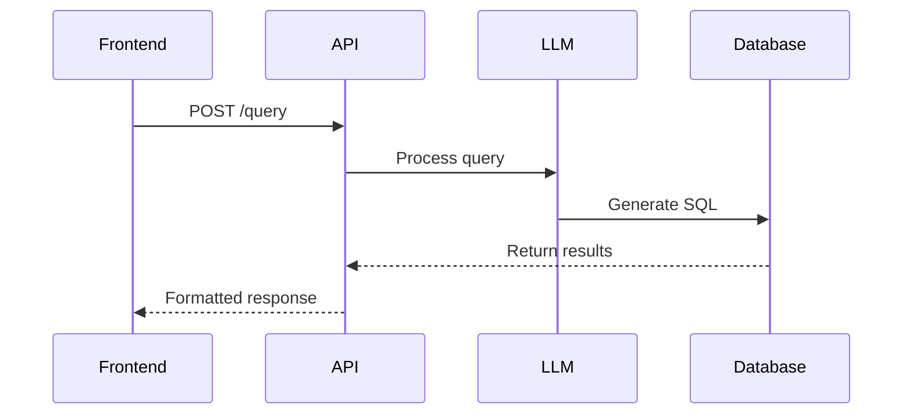

# API Usage Guide

## Authentication
Currently using API key in `TOGETHER_API_KEY` environment variable

## Rate Limits
- 10 requests/minute
- 100 requests/day

## Rate Limiting Headers
```powershell
$response.Headers['X-RateLimit-Limit']        # 100
$response.Headers['X-RateLimit-Remaining']   # 99
$response.Headers['X-RateLimit-Reset']      # 1708524000 (Unix timestamp)
```

## Error Codes
```json
{
    "403": "Invalid API key",
    "429": "Rate limit exceeded",
    "500": "Server error"
}
```

## Example Query Flow

