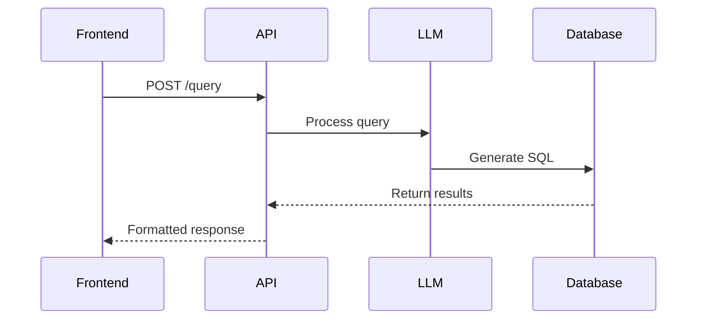

# API Usage Guide

## Base URL
The base URL for all API endpoints is:
http://localhost:5000/api/rag-sql-chatbot

## Authentication
Currently using API key in `TOGETHER_API_KEY` environment variable

## Endpoints

### Health Check
```powershell
curl.exe http://localhost:5000/api/rag-sql-chatbot/health
```

### Query Endpoint
### PowerShell Example
```powershell
$headers = @{
    "Content-Type" = "application/json"
}

$body = @{
    message = "Show me education projects in Zomba"
    source_lang = "english"
    page = 1
    page_size = 10
} | ConvertTo-Json

Invoke-WebRequest -Uri "http://localhost:5000/api/rag-sql-chatbot/query" `
    -Method Post `
    -Headers $headers `
    -Body $body
```

### Curl Example
```bash
curl -X POST http://localhost:5000/api/rag-sql-chatbot/query \
  -H "Content-Type: application/json" \
  -d '{
    "message": "What is the total budget for infrastructure projects?",
    "source_lang": "english",
    "page": 1,
    "page_size": 30,
    "continue_previous": false
  }'
```

## Request Format
```json
{
    "message": "Your query here",
    "source_lang": "english",
    "page": 1,
    "page_size": 30,
    "continue_previous": false
}
```

## Response Format
```json
{
    "response": "The total budget for infrastructure projects is...",
    "metadata": {
        "query_time": "2025-02-21T15:30:48",
        "sql_query": "SELECT SUM(budget) FROM proj_dashboard...",
        "source": "proj_dashboard"
    }
}
```

## Rate Limits
- 10 requests/minute
- 100 requests/day

## Rate Limiting Headers
```powershell
$response.Headers['X-RateLimit-Limit']      # 100
$response.Headers['X-RateLimit-Remaining']  # 99
$response.Headers['X-RateLimit-Reset']      # 1708524000 (Unix timestamp)
```

## Error Codes
```json
{
    "403": "Invalid API key",
    "429": "Rate limit exceeded",
    "500": "Server error"
}
```

## Example Query Flow

