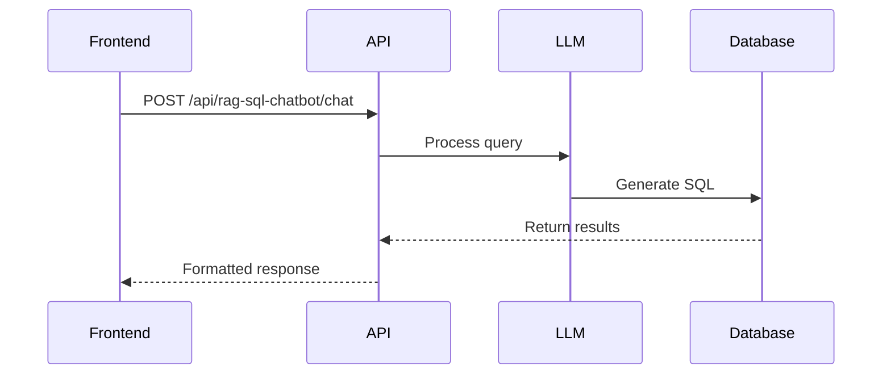

# API Usage Guide

## Base URL
The base URL for all API endpoints is:
http://154.0.164.254:5000

## Authentication
Currently using API key in `TOGETHER_API_KEY` environment variable

## Endpoints

### Health Check
```powershell
curl.exe http://154.0.164.254:5000/health
```

### Chat Endpoint
```
POST /api/rag-sql-chatbot/chat
```

This endpoint handles natural language queries about infrastructure projects in Malawi.

#### Request Format

- Method: POST
- Content-Type: application/json
- Request Body:
```json
{
  "message": "your natural language query here"
}
```

#### Example Queries

```bash
# Query projects in a specific district
curl -X POST http://154.0.164.254:5000/api/rag-sql-chatbot/chat \
  -H "Content-Type: application/json" \
  -d '{"message": "What are the ongoing projects in Lilongwe?"}'

# Query project status
curl -X POST http://154.0.164.254:5000/api/rag-sql-chatbot/chat \
  -H "Content-Type: application/json" \
  -d '{"message": "Show me all completed water projects"}'

# Query project budget
curl -X POST http://154.0.164.254:5000/api/rag-sql-chatbot/chat \
  -H "Content-Type: application/json" \
  -d '{"message": "What is the total budget for infrastructure projects in Blantyre?"}'
```

#### Response Format

```json
{
  "response": {
    "answer": "Natural language response to the query",
    "sql_query": "The SQL query that was executed",
    "results": [
      {
        "project_name": "Example Project",
        "district": "District Name",
        "project_sector": "Sector Name",
        "status": "Project Status",
        "budget_mwk": "Budget Amount",
        "completion_percentage": "Completion %"
      }
    ]
  }
}
```

## Error Handling

The API returns appropriate HTTP status codes:

- 200: Successful query
- 400: Invalid request format
- 500: Server error

Error responses include a message explaining the error:

```json
{
  "error": "Error message describing what went wrong"
}
```

## Rate Limits
- 60 requests/minute
- Responses include rate limit headers:
  - X-RateLimit-Limit
  - X-RateLimit-Remaining
  - X-RateLimit-Reset

## Rate Limiting Headers
```powershell
$response.Headers['X-RateLimit-Limit']      # 60
$response.Headers['X-RateLimit-Remaining']  # 59
$response.Headers['X-RateLimit-Reset']      # 1708524000 (Unix timestamp)
```

## Error Codes
```json
{
    "403": "Invalid API key",
    "429": "Rate limit exceeded",
    "500": "Server error"
}
```

## Example Query Flow


## Best Practices

1. Always include the "message" field in your request
2. Keep queries concise and specific
3. Handle rate limiting appropriately
4. Implement proper error handling
5. Cache responses when appropriate
