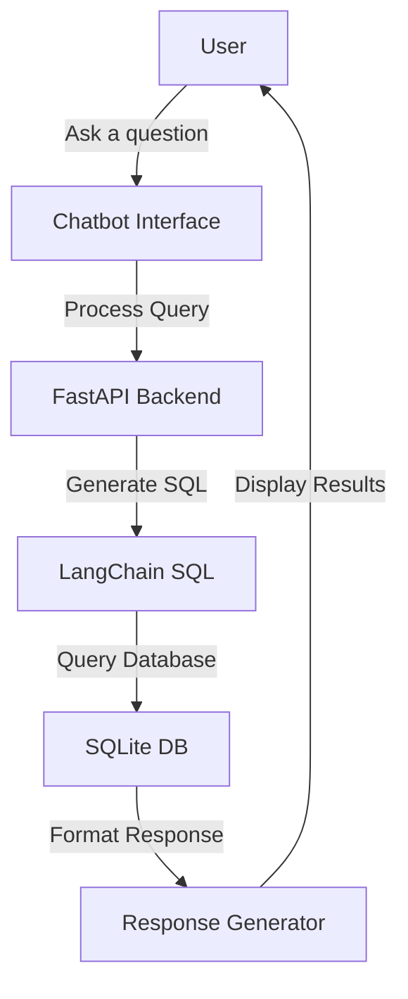
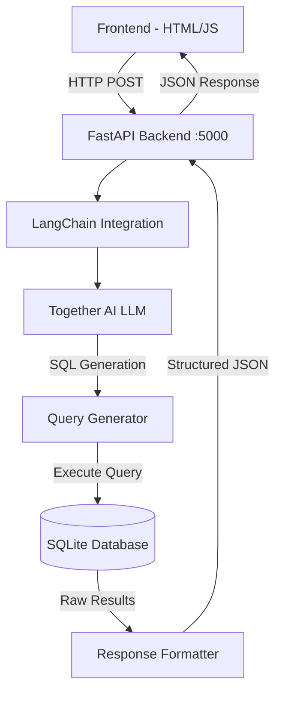

# Infrastructure Projects Chatbot Documentation

## Overview

The Infrastructure Projects Chatbot (Dwizani) is designed to make it easy for users to get information about infrastructure projects in Malawi. This document explains both the user-facing functionality and the technical implementation details.

## User Guide

### Basic Operation



### Response Types

1. **General Query Response**
   ```mermaid
   graph TD
       A[General Response] --> B[Project Name]
       A --> C[Fiscal Year]
       A --> D[Location]
       D --> D1[Region]
       D --> D2[District]
       A --> E[Total Budget]
       A --> F[Project Status]
       A --> G[Project Sector]
   ```

2. **Specific Query Response**
   ```mermaid
   graph TD
       A[Detailed Response] --> B[Basic Info]
       B --> B1[Project Name]
       B --> B2[Fiscal Year]
       B --> B3[Location]
       B3 --> B3a[Region]
       B3 --> B3b[District]
       A --> C[Financial Info]
       C --> C1[Total Budget]
       C --> C2[Expenditure to Date]
       C --> C3[Source of Funding]
       A --> D[Project Details]
       D --> D1[Project Status]
       D --> D2[Project Sector]
       D --> D3[Project Code]
       A --> E[Contractor Info]
       E --> E1[Contractor Name]
       E --> E2[Contract Start Date]
       A --> F[Monitoring]
       F --> F1[Last Council Visit]
   ```

## Technical Implementation

### System Architecture



### API Endpoints

1. **Health Check**
   ```http
   GET http://localhost:5000/api/rag-sql-chatbot/health
   ```

2. **Query Endpoint**
   ```http
   POST http://localhost:5000/api/rag-sql-chatbot/query
   Content-Type: application/json

   {
     "message": "Show education projects in Zomba",
     "source_lang": "english",
     "page": 1,
     "page_size": 10
   }
   ```

### Database Schema

The chatbot queries the 'proj_dashboard' table with the following key columns:

```sql
CREATE TABLE proj_dashboard (
    PROJECTNAME TEXT,
    FISCALYEAR TEXT,
    REGION TEXT,
    DISTRICT TEXT,
    TOTALBUDGET NUMERIC,
    PROJECTSTATUS TEXT,
    PROJECTSECTOR TEXT,
    CONTRACTORNAME TEXT,
    CONTRACTSTARTDATE TEXT,
    EXPENDITURETODATE NUMERIC,
    SOURCEOFFUNDING TEXT,
    PROJECTCODE TEXT,
    LASTMONITORINGVISIT TEXT
);
```

### Query Processing Flow

1. **User Input Processing**
   - Validate input
   - Extract key information
   - Determine query type (general vs specific)

2. **SQL Generation**
   - Use Together AI LLM to generate SQL
   - Apply query templates based on question type
   - Ensure proper column names and table references

3. **Response Formatting**
   - Format results based on query type
   - General queries: Basic project information
   - Specific queries: Detailed project information
   - Handle null values and data formatting

4. **Error Handling**
   - Invalid queries
   - No results found
   - Database connection issues
   - LLM generation errors

### Example Queries and Responses

1. **General Query**
   ```sql
   -- Show education projects in Zomba
   SELECT * FROM proj_dashboard 
   WHERE DISTRICT = 'Zomba' 
   AND PROJECTSECTOR = 'Education';
   ```

2. **Specific Query**
   ```sql
   -- Details about Chilipa CDSS Girls Hostel
   SELECT * FROM proj_dashboard 
   WHERE PROJECTNAME LIKE '%Chilipa CDSS Girls Hostel%';
   ```

## Malawi Infrastructure Projects Chatbot Flow

### Overview
Dwizani (meaning "what you should know" in Chichewa) is a natural language interface for querying the Malawi infrastructure projects database. The system follows a clear flow from user input to natural language response.

### Detailed Flow

### 1. Natural Language Query Input
- User submits a natural language question through the frontend
- Example: "Show me all education projects in Lilongwe"
- Request is sent to `/api/rag-sql-chatbot/chat` endpoint
- Query is logged for debugging and monitoring

### 2. Query Processing & SQL Generation
- Natural language query is analyzed for intent and entities
- SQL query is generated using LLM (Together AI)
- Query undergoes transformations for:
  - Case-insensitive matching
  - Date formatting
  - NULL handling
- Generated SQL is logged for verification
- Example SQL:
  ```sql
  SELECT 
    projectname as project_name,
    district,
    projectsector as project_sector,
    projectstatus as project_status,
    budget as total_budget,
    completionpercentage as completion_percentage,
    substr(startdate,1,4) || '-' || substr(startdate,5,2) || '-' || substr(startdate,7,2) as start_date,
    substr(completiondata,1,4) || '-' || substr(completiondata,5,2) || '-' || substr(completiondata,7,2) as completion_date
  FROM proj_dashboard 
  WHERE LOWER(district) = LOWER('Lilongwe') 
  AND LOWER(projectsector) = LOWER('Education');
  ```

### 3. Database Interaction
- SQL query is executed against SQLite database
- Results are validated and cleaned
- Data is formatted for consistency
- Performance metrics are collected:
  - Query execution time
  - Number of results
  - Any errors encountered

### 4. Natural Language Response Generation
- Raw database results are transformed into structured format
- Response includes:
  - Natural language summary of findings
  - Formatted project details
  - Relevant statistics
  - Query metadata
- Example Response:
  ```json
  {
    "response": {
      "text": "I found 2 education projects in Lilongwe:",
      "results": [
        {
          "project_name": "Lilongwe School Construction Phase 3",
          "district": "Lilongwe",
          "project_sector": "Education",
          "project_status": "Completed",
          "total_budget": {
            "amount": 987244.90,
            "formatted": "MWK 987,244.90"
          },
          "completion_percentage": 10,
          "start_date": "2024-11-01",
          "completion_date": "2025-11-01"
        }
      ],
      "metadata": {
        "total_results": 2,
        "query_time": "0.15s",
        "sql_query": "SELECT..."
      }
    }
  }
  ```

### 5. Frontend Display
- Response is rendered in user-friendly format
- Shows:
  - Natural language summary
  - Structured project information
  - Relevant statistics
  - Query performance metrics

## Debugging and Monitoring
- Each step logs detailed information:
  - Input query
  - Generated SQL
  - Query execution metrics
  - Response formatting
- Errors are caught and logged at each stage
- Performance metrics are tracked

## Error Handling
- Invalid queries are caught and explained
- Database errors return helpful messages
- Network issues are handled gracefully
- All errors include:
  - Error description
  - Error location
  - Troubleshooting suggestions

## Testing and Monitoring

### Health Checks
```powershell
curl http://localhost:5000/api/rag-sql-chatbot/health
```

### Performance Monitoring
- Response times
- Query success rates
- LLM generation accuracy
- Database query performance

## Future Improvements

1. **Query Processing**
   - Enhanced natural language understanding
   - Better handling of complex queries
   - Support for more query types

2. **Response Quality**
   - More detailed error messages
   - Better handling of edge cases
   - Enhanced response formatting

3. **Performance**
   - Query optimization
   - Caching frequently requested data
   - Batch processing for large result sets