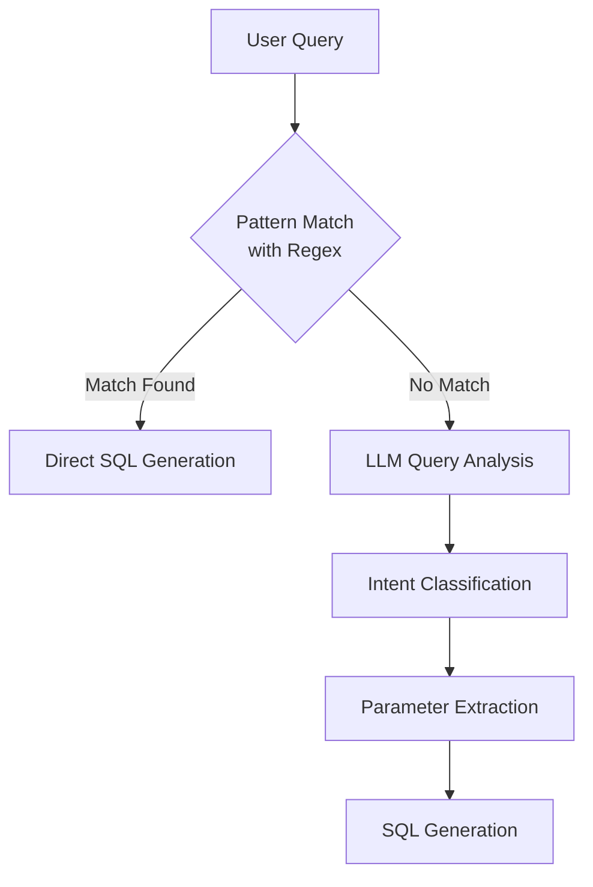

# Query Classification Improvement Recommendations

## Test Results Analysis

Based on the comprehensive testing of the Dziwani chatbot query classification system, we have identified significant gaps in the current implementation. The test results reveal a clear pattern of strengths and weaknesses:

### Current Performance by Category

| Category | Pass Rate | Analysis |
|----------|-----------|----------|
| Sector-Based Queries | 100% | Excellent handling of sector-related queries |
| Combined Queries | 33% | Limited support for combined district+sector queries |
| District Queries | 20% | Poor handling of district name variations |
| Project-Specific Queries | 0% | No support for project detail queries |
| Budget-Related Queries | 0% | No support for budget-related questions |
| Status-Based Queries | 0% | No support for status filtering |
| Time-Based Queries | 0% | No support for temporal queries |
| Edge Cases | 0% | No robustness for edge cases |

### Overall System Performance
- **Total Pass Rate: 19%**
- **Total Tests: 26**
- **Passed: 5**
- **Failed: 21**

## Key Issues Identified

1. **Over-reliance on Rigid Regex Patterns**
   - Current patterns only handle very specific phrasings
   - No flexibility for natural language variations
   - Limited to sector and some district queries

2. **Missing Query Types**
   - No support for project details retrieval
   - No budget query handling
   - No status filtering
   - No temporal query support

3. **Limited Entity Recognition**
   - Poor district name extraction
   - No project name recognition
   - No budget value extraction
   - No date/time extraction

4. **No Fuzzy Matching**
   - Typos in district names cause failures
   - Variations in project names not recognized

## Recommended Approach: Hybrid Classification System

We recommend implementing the hybrid classification system outlined in the LLM-enhanced classification proposal:

### 1. Two-Tier Classification Architecture



### 2. Implementation Priorities

1. **Implement LLM Classification Fallback**
   - Use the LLM to classify queries that don't match regex patterns
   - Extract entities and parameters from natural language
   - Generate appropriate SQL based on classification

2. **Enhance Existing Regex Patterns**
   - Expand district query patterns to handle more variations
   - Add project-specific query patterns
   - Improve entity extraction from matched patterns

3. **Add Support for Missing Query Types**
   - Budget queries
   - Status-based filtering
   - Temporal queries
   - Combined multi-parameter queries

4. **Implement Fuzzy Matching**
   - Add fuzzy matching for district names
   - Implement project name approximate matching
   - Handle common typos and variations

### 3. Specific Code Improvements

#### LLM Classification Function

```python
async def classify_query_with_llm(user_query: str) -> dict:
    """
    Use LLM to classify the query type and extract relevant parameters.
    """
    prompt = f"""
    You are an assistant for a Malawi infrastructure project database.
    Classify this user query: "{user_query}"
    
    Return a JSON object with the following structure:
    {{
        "query_type": "district|project|sector|budget|status|time|combined",
        "parameters": {{
            "districts": ["district_name1", "district_name2"],
            "projects": ["project_name1", "project_name2"],
            "sectors": ["sector_name1", "sector_name2"],
            "budget_range": {{"min": null, "max": null}},
            "status": ["completed", "in_progress", "planned"],
            "time_range": {{"start": "YYYY-MM-DD", "end": "YYYY-MM-DD"}}
        }}
    }}
    
    Only include parameters that are relevant to the query.
    """
    
    llm_response = await call_llm_api(prompt)
    
    try:
        classification = json.loads(llm_response)
        return classification
    except json.JSONDecodeError:
        return {
            "query_type": "unknown",
            "parameters": {}
        }
```

#### Enhanced District Query Patterns

```python
# Current pattern
district_pattern = r"(?:in|about|for|from)\s+(\w+)\s+(?:district|area|region)"

# Enhanced patterns
district_patterns = [
    r"(?:in|about|for|from)\s+(\w+)\s+(?:district|area|region)",
    r"(\w+)\s+(?:district|area|region)(?:'s)?\s+projects",
    r"(?:show|list|tell|give)\s+(?:me|us)?\s+(?:all|the)?\s+(?:projects|developments|initiatives)\s+(?:in|about|for|from)\s+(\w+)",
    r"(?:projects|developments|initiatives)\s+(?:located|situated|based)\s+(?:in|at|near)\s+(\w+)",
    r"what(?:'s|s|is)?\s+(?:happening|going on|taking place)\s+(?:in|at|near)\s+(\w+)",
    r"(\w+)(?:\s+district)?\s+(?:projects|developments|initiatives)"
]
```

#### Project-Specific Query Patterns

```python
project_patterns = [
    r"(?:about|details|information|tell me about|describe)\s+(?:the|a)?\s+([\w\s]+project|[\w\s]+scheme|[\w\s]+initiative)",
    r"(?:what is|what's|details of|info on)\s+(?:the|a)?\s+([\w\s]+project|[\w\s]+scheme|[\w\s]+initiative)",
    r"([\w\s]+project|[\w\s]+scheme|[\w\s]+initiative)\s+(?:details|information|description)"
]
```

### 4. Testing and Monitoring

1. **Continuous Testing**
   - Run the test suite regularly to track improvements
   - Add new test cases as patterns emerge

2. **Feedback Loop**
   - Capture failed queries for analysis
   - Use failures to improve classification

3. **Performance Metrics**
   - Track classification accuracy over time
   - Monitor category-specific performance

## Implementation Plan

### Phase 1: Immediate Improvements (1-2 weeks)
- Enhance existing regex patterns for district queries
- Add project-specific query patterns
- Implement fuzzy matching for district names

### Phase 2: LLM Integration (2-3 weeks)
- Implement LLM classification function
- Integrate with existing query processing pipeline
- Set up monitoring for classification accuracy

### Phase 3: Comprehensive Coverage (3-4 weeks)
- Add support for all missing query types
- Refine LLM prompts for better classification
- Optimize performance and response time

## Expected Outcomes

By implementing these recommendations, we expect to see:

1. **Improved Overall Pass Rate**
   - Target: 80%+ pass rate across all query types
   - Significant improvements in district and project queries

2. **Better User Experience**
   - More natural interaction with the chatbot
   - Higher success rate for varied phrasings

3. **Reduced Maintenance Burden**
   - Less need to manually create regex patterns
   - Automatic adaptation to new query variations

4. **More Comprehensive Query Support**
   - Support for all query types in the test plan
   - Ability to handle complex, multi-parameter queries
