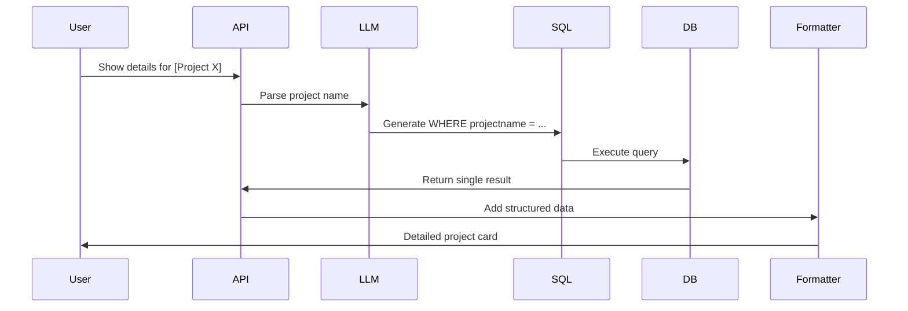

# Specific Project Drill Down Mechanism

## Overview
This functionality enables users to get detailed information about individual infrastructure projects by:
1. Identifying specific project references in natural language queries
2. Generating precise SQL queries for single-project retrieval
3. Formatting detailed responses with structured data

## Key Components

### 1. Query Recognition
```python
# In langchain_sql.py
if "details for" in query.lower() or "information about" in query.lower():
    return self._handle_specific_project_query(query)
```

### 2. SQL Generation
```sql
-- Sample generated query
SELECT 
    projectname, district, budget, 
    completion_percentage, contractor,
    start_date, completion_date
FROM proj_dashboard
WHERE projectname = 'Lilongwe Water Supply Construction Phase 48';
```

### 3. Response Formatting
```python
# format_response() handles single-project responses differently
if len(query_results) == 1:
    response['data'] = query_results[0]
    response['message'] += " Full details:\n" + format_project_details(query_results[0])
```

## Natural Language Query Examples

### 1. Direct Project Name Queries
```
User: "Show me details for Lilongwe Water Supply Construction Phase 48"
User: "Tell me about the Kasungu School Construction Phase 49 project"
User: "What is the status of Salima School Construction Phase 47?"
```

### 2. Project Attribute Queries
```
User: "Which project in Lilongwe has a budget of 45 million?"
User: "Show me the water project that started in 2024"
User: "Find the school construction project that is 85% complete"
```

### 3. Contextual Follow-up Queries
```
User: "What projects are in Lilongwe?"
System: "I found 20 projects in Lilongwe..."
User: "Show me more details about the Water Supply project"
```

### 4. Specific Detail Queries
```
User: "Who is the contractor for Lilongwe Water Supply Phase 48?"
User: "What is the completion percentage of the Kasungu School project?"
User: "When did the Salima School Construction start?"
```

Each type of query triggers the drill-down mechanism differently:
- Direct name queries use exact matching
- Attribute queries use WHERE clauses with specific conditions
- Follow-up queries maintain context from previous interactions
- Detail queries focus on specific project fields

## Example Workflow


## Error Handling
- **No matches**: Returns "No project found matching [name]"
- **Multiple matches**: Shows top 3 matches with "Did you mean...?"
- **Partial matches**: Uses SQL LIKE operator with wildcards

[See full implementation](app/database/langchain_sql.py)
