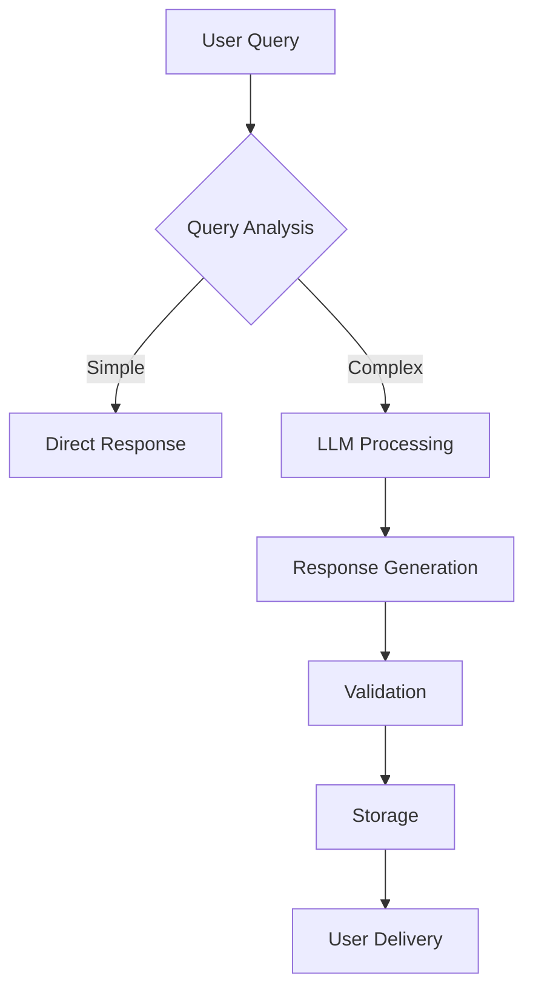

# LLM Response Integration Implementation Plan

## Phase 1: Response Requirements

### Response Taxonomy
- **Greetings**: Initial user interactions
- **General Info**: System capabilities explanations
- **Data Results**: Structured query responses
- **Errors**: Failed query handling
- **Fallbacks**: Unhandled query responses

### Storage Requirements
```json
{
  "required_metadata": [
    "timestamp",
    "query_type",
    "response_format",
    "processing_time",
    "llm_model_version"
  ]
}
```

## Phase 2: LLM Integration Strategy

### Model Configuration
| Parameter        | Value | Rationale               |
|------------------|-------|-------------------------|
| Temperature      | 0.2   | Factual consistency     |
| Max Tokens       | 512   | Response length control |
| Presence Penalty | 0.5   | Reduce repetition       |

## Phase 3: Response Pipeline



## Phase 4: Storage Architecture

### File Rotation Strategy
- Daily log files
- 7-day retention
- Gzip compression

### Data Schema
```json
{
  "response_id": "UUIDv4",
  "session_context": {
    "user_id": "anonymous|authenticated",
    "device_type": "web|mobile"
  },
  "llm_metadata": {
    "model": "Meta-Llama-3.1-8B",
    "prompt_version": "v2.3"
  }
}
```

## Phase 5: Security Implementation

### Protection Measures
1. PII Redaction Pipeline
2. Content Scanning
3. Encryption-at-rest
4. Access Logging

## Implementation Roadmap

1. Core Response Handling (Week 1-2)
2. Storage System (Week 3)
3. Monitoring (Week 4)
4. Security Audit (Week 5)

## Key Metrics

| Metric                  | Target      |
|-------------------------|-------------|
| Response Latency        | < 2s        |
| Storage Reliability     | 99.9%       |
| Error Rate              | < 0.5%      |
| Security Vulnerabilities| 0 Critical  |

## Implementation Checklist

### Phase 1: Setup & Configuration
- [ ] Define all response types and formats
- [ ] Create prompt templates for each response type
- [ ] Configure LLM parameters (temperature, max tokens)
- [ ] Set up error handling framework

### Phase 2: Core Implementation
- [ ] Implement intent detection system
- [ ] Create response generation pipeline
- [ ] Develop response validation mechanisms
- [ ] Build storage integration

### Phase 3: Testing & Validation
- [ ] Create test suite for each response type
- [ ] Validate response quality and accuracy
- [ ] Test error handling and recovery
- [ ] Measure response latency under load

### Phase 4: Security & Compliance
- [ ] Implement PII detection and redaction
- [ ] Set up access controls for stored responses
- [ ] Conduct security review
- [ ] Document compliance measures

### Phase 5: Deployment & Monitoring
- [ ] Deploy to staging environment
- [ ] Set up monitoring dashboards
- [ ] Implement alerting for failures
- [ ] Document maintenance procedures
